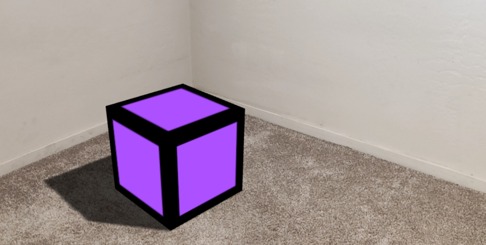

# three.js: World Effects (SLAM)

This sample contains a basic three.js scene integrated with the 8th Wall Engine Binary.



<details><summary>Try it out</summary>

https://8thwall.org/threejs-world-effects-example/


</details>

## Usage

1. On this repository, click **Code** > **Download ZIP**. If you clone the repository instead, make sure you have Git LFS installed and run `git lfs pull`
2. Unzip the folder to the location you'd like to work in
3. `npm install`
4. `npm run serve`
5. To connect to a mobile device, follow [these instructions](https://8th.io/test-on-mobile)
6. Recommended: Track your files using [git](https://git-scm.com/about) to avoid losing progress

## Deployment

This project contains Github Actions configuration for deployment to Github Pages, which triggers automatically by pushing the `main` branch. You can also create a production build using `npm run build`, which outputs the production build to the `dist` folder, and publish to the web using [this guide](https://8thwall.org/docs/getting-started/publishing#self-hosting-your-project).

## Questions?

Please raise any questions on [Github Discussions](https://github.com/orgs/8thwall/discussions) or join the [Discord](https://8th.io/discord) to connect with the community.

## Note

This project relies on the [8th Wall Engine](https://www.npmjs.com/package/@8thwall/engine-binary), [XRExtras](https://www.npmjs.com/package/@8thwall/xrextras), and [Landing Page](https://www.npmjs.com/package/@8thwall/landing-page) which are loaded as script tags in `index.html`.

```
<script src="https://cdn.jsdelivr.net/npm/@8thwall/engine-binary@1/dist/xr.js" async crossorigin="anonymous" data-preload-chunks="slam"></script>
<script src="https://cdn.jsdelivr.net/npm/@8thwall/xrextras@1/dist/xrextras.js" crossorigin="anonymous"></script>
<script src="https://cdn.jsdelivr.net/npm/@8thwall/landing-page@1/dist/landing-page.js" crossorigin="anonymous"></script>
```
